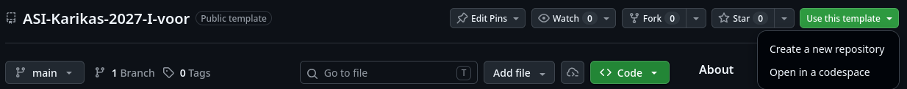
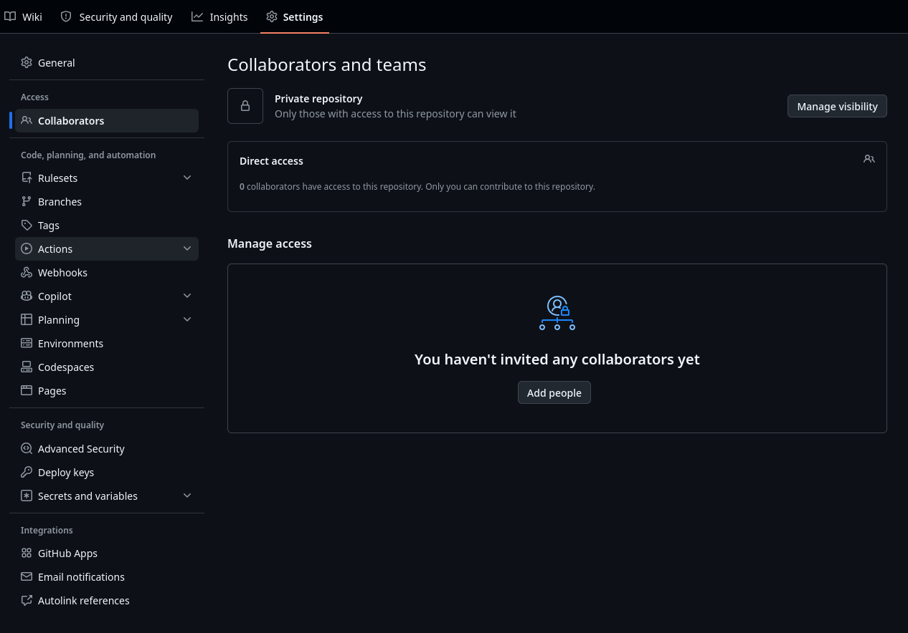
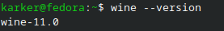
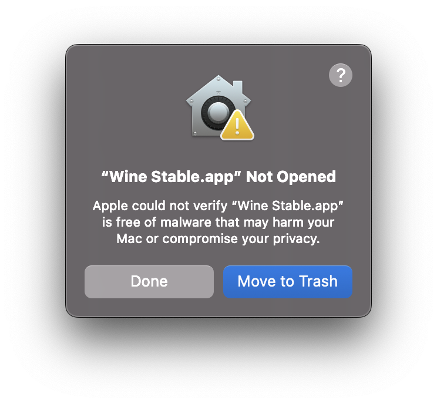
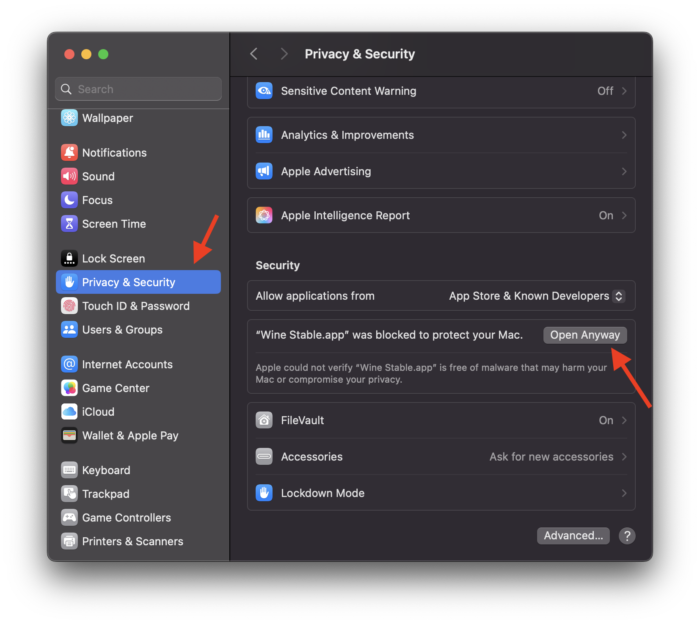
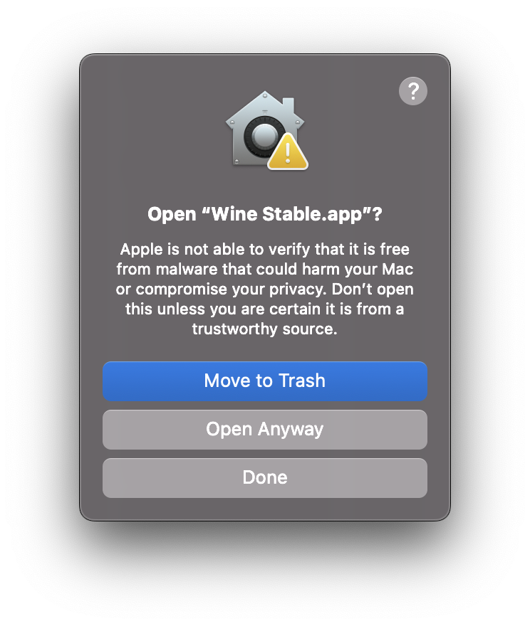
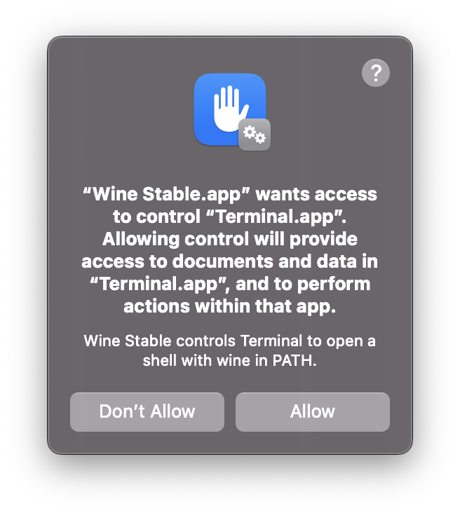
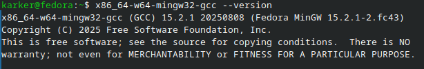

# ASI Karikas 2027 - I voor

## Sisukord
- [Alusta siit!](#alustuseks)
- [Ülesanded](#ülesanded)
- [Simulaator](#simulaator)
- [AI kasutamise juhend](ai-usage/README.md)
- [Linuxi ja macOS-i juhend simulaatori kasutamiseks](#linuxi-ja-macos-i-juhend-simulaatori-kasutamiseks)

## Alusta siit!
### 1. Registreeri ennast võistlusele

Selleks, et saaksime Sinu osalemise ära kaardistada, siis kui veel pole, täida ära [**LIITUMISANKEET**](https://pilves.lapikud.ee/apps/forms/s/pETWDxgowe6K6Zjb5wmXfwz8).

Ankeeti sisestatud e-posti aadressi kaudu saame Sind ka hoida kursis tähtsa informatsiooniga, näiteks kui midagi ajakavas, ülesannetes või reeglites peaks muutuma.

### 2. Loo oma repositoorium ning lisa *Collaborator*id

Selleks, et saaksid lahendama hakata, pead looma endale repositooriumi (edaspidi repo). Sinna peavad ilmuma Sinu lahendused I vooru väljakutse ülesannetele.

***Fork*e me ei kontrolli. Sinu lahendused peavad olema privaatses repos.**

Soovitame selleks I vooru väljakutse repo *template*'i põhjal endale repo luua.

Vajuta **Use this template** nupu peale ning vali **Create a new repository**.



Pane enda repositooriumile nimi, näiteks "I-vooru-lahendused" või muu säärane nimi.
Kõige tähtsam on valida, et repositooriumi nähtavus oleks **Private** peal.

Seejärel vajuta **Create repository**.

Et saaksime hiljem Sinu töö üle vaadata, pead selleks enda repositooriumis andma ASI Karika korraldajatele ligipääsu.

Selleks tuleb lisada *Collaborator*id.

Vajuta enda äsjaloodud repositooriumis **Settings** -> **Collaborators** -> **Add people**



Seejärel lisa *Collaborator*iteks **kar-ker**, **ReneArumetsa**, **artjom3729**, **aUserSM**.

Korraldajad võtavad jooksvalt kutseid vastu.

### 3. Klooni repositoorium enda arvutisse

Selleks, et saaksid ülesandeid enda arvutis lahendada, tuleb loodud repositoorium **kloonida**. Kloonimine loob arvutisse repo kohaliku koopia, kus saad faile muuta ning hiljem lahendused GitHubi üles laadida.

**Klooni enda loodud privaatne repo.**

#### 1. Paigalda Git

Repo kloonimiseks on vaja programmi **Git**. Vali enda operatsioonisüsteemile sobiv juhis.

**Windows**

Laadi Git alla [Giti ametlikult veebilehelt](https://git-scm.com/downloads/win) ning käivita paigaldaja. Paigaldamisel võid kasutada vaikimisi valikuid.

Pärast paigaldamist ava Start-menüüst **Git Bash**. Järgnevad Windowsi käsud sisesta selles aknas.

**Linux**

Ava terminal ning vali oma distributsioonile sobiv käsk.

Debian / Ubuntu:

```bash
sudo apt update
sudo apt install git
```

Arch Linux:

```bash
sudo pacman -S git
```

Fedora:

```bash
sudo dnf install git
```

**macOS**

Ava **Terminal** ning sisesta:

```bash
git --version
```

Kui Git pole paigaldatud, võib macOS pakkuda arendustööriistade paigaldamist. Nõustu paigaldamisega ning järgi ekraanil kuvatavaid juhiseid.

Kui kasutad juba Homebrew’d, saad Giti paigaldada ka järgmise käsuga:

```bash
brew install git
```

**Kontrolli paigaldust**

Kõigis kolmes operatsioonisüsteemis saad paigaldust kontrollida käsuga:

```bash
git --version
```

Terminalis peaks ilmuma Giti versiooninumber.

#### 2. Vali arvutis repo asukoht

Ava **Windowsis Git Bash** ning **Linuxis või macOS-is Terminal**.

Näiteks saad luua kodukausta alla kausta `ASI-Karikas` ning sinna liikuda:

```bash
mkdir -p ~/ASI-Karikas
cd ~/ASI-Karikas
```

Need käsud sobivad kõigis kolmes süsteemis, kui kasutad Windowsis Git Bashi.

#### 3. Klooni repo

Repo saad kloonida **HTTPS-i** või **SSH** kaudu. Soovitame **SSH** kaudu.

**HTTPS-i kaudu**

Vali GitHubis enda repo lehel **Code -> HTTPS**, kopeeri aadress ning sisesta terminalis:

```bash
git clone https://github.com/SINU-KASUTAJANIMI/I-vooru-lahendused.git
```

Asenda näidisaadress enda repo aadressiga. Kui küsitakse sisselogimist, järgi kuvatavaid juhiseid.

> **Pane tähele:** kui terminal küsib parooli, kasuta GitHubi konto parooli asemel **personal access token**'it. Selle kohta on informatsioon [GitHubi dokumentatsioonis](https://docs.github.com/en/authentication/keeping-your-account-and-data-secure/managing-your-personal-access-tokens).

**SSH kaudu**

Kui sinu arvuti SSH-võti on GitHubi kontole lisatud, vali repo lehel **Code -> SSH**, kopeeri aadress ning sisesta:

```bash
git clone git@github.com:SINU-KASUTAJANIMI/I-vooru-lahendused.git
```

Asenda näidisaadress enda repo SSH-aadressiga. Kui SSH-võti on kaitstud paroolifraasiga, võidakse küsida seda.

Kui SSH-võtit pole veel seadistatud, järgi [GitHubi SSH seadistamise juhendit](https://docs.github.com/en/authentication/connecting-to-github-with-ssh).

**Ava kloonitud repo kaust**

Pärast kloonimist liigu repo kausta:

```bash
cd I-vooru-lahendused
```

Kui panid repole teise nime, kasuta käsus seda nime.

**Nüüd on repo sinu arvutis olemas ning saad hakata ülesandeid lahendama.**

#### 4. Laadi lahendused GitHubi üles

(Võid seda ka praegu testimiseks ära proovida ehk ei pea ootama, kui kõik ülesanded lahendatud. Arendamise hea tava on mingi suurema tüki valmimisel enda kood GitHubi saata. Selleks versioonihaldus ongi, et kui juhtub midagi sinu lokaalses keskkonnas, siis saaksid hiljem selle pilvest tagasi kloonida või erinevates seadmetes koodile ligi pääseda.)

Arvutis tehtud muudatused ei ilmu GitHubi automaatselt. Selleks tuleb need Giti abil salvestada ning üles laadida.

Enne esimest muudatuste salvestamist määra repo kaustas enda nimi ja e-posti aadress:

```bash
git config user.name "Sinu nimi"
git config user.email "sinu-email@example.com"
```

Asenda näidisandmed enda omadega. E-posti aadressina võid kasutada GitHubi kontoga seotud aadressi või GitHubi seadetes kuvatavat privaatset `noreply`-aadressi.

Pärast lahenduste muutmist ja failide salvestamist kontrolli repo kaustas, millised failid on muutunud:

```bash
git status
```

Lisa üleslaadimiseks soovitud failid, näiteks:

```bash
git add micro_main.c
```

Asenda `micro_main.c` enda lahendusfaili nime või teega. Mitme faili lisamiseks korda käsku iga vajaliku faili kohta.

Võid ka kasutada käsku, mis lisab kohe kõik failid selles kaustas, kus parasjagu oled:

```bash
git add .
```

Seejärel salvesta muudatused ning laadi need GitHubi:

```bash
git commit -m "Lisa I vooru lahendus"
git push
```

Ava GitHubis enda repo ning kontrolli, et lahendusfailid ja viimased muudatused on seal olemas.

**Korraldajad näevad ainult neid lahendusi, mille oled GitHubi üles laadinud, mitte neid, mida oled teinud enda arvutis lokaalselt.**

## Ülesanded

Ülesanded tuleb lahendada **microcontroller_simulator_3.3** olevas kaustas failidesse **ex1...4.c**.

Juhul kui kasutad tehisintellekti tööriistu, siis nende kasutamine pane kirja kaustas **ai-usage** olevatesse failidesse **ai-usage/README.md** ja **ai-usage/prompts.md**.

### 1. osa ülesanded

Lahenda vähemalt kaks järgnevast kolmest ülesandest:

#### ex1) Mikrokontrolleril on RGB LED mis võimaldab näidata erinevaid värve segades kokku punast, rohelist, sinist. Tee kood, mis muudab RGB LED värvi punase rohelise sinise vahel tsüklis. Lahenda ülesanne **microcontroller_simulator_3.3/ex1.c** faili.

#### ex2) Mikrokontrolleril on 5 nuppu ja buzzer, mis võimaldab heli tekitada. Te kood nii, et kõik 5 nuppu teeksid erineva sagedusega ja/või volüümika heli. Siis saab mikrokontrolleriga heli mängida ja seda kasutada nagu süntesaatorit. Lahenda ülesanne **microcontroller_simulator_3.3/ex2.c** faili.

#### ex3) Mikrokontrolleril on 8 nuppu ja 8 lülitit. Kaugelt vaadates võib olla raske aru saada, mis olekus lülitid on. Tee kood, mis näitaks lüliti kohal oleva LED'i kaudu mis olekus lüliti on. Kui Lüliti on all lükatud, siis selle lüliti peal olev LED põleks. Kui lüliti on ülese lükatud, siis oleks see LED kustus. Lahenda ülesanne **microcontroller_simulator_3.3/ex3.c** faili.

### 2. osa ülesanne

#### ex4) Olles nüüd mõne ülesande ära lahendanud tuleks mõelda midagi ise välja. Kirjuta faili **microcontroller_simulator_3.3/ex4.c** sarnane ülesandepüstitus nagu 1. osas ja lahenda seal ka see ülesanne ära.

> [ESITA I VOORU TÖÖ SIIN](https://pilves.lapikud.ee/apps/forms/s/tmyNZSq9Mm4yLb9DpgdRXB7A)

## Simulaator

ASI Karika 2027 I vooru väljakutse on rajatud mikrokontrolleri simulaatori peale. See simulaator on koostatud ühe TalTechi Integreeritud Tehnoloogiate tudengi **Sten Markus Sirkase** (stsirk@taltech.ee) lõputöö raames.

> Oluline kaust on **microcontroller_simulator_3.3/documentation**

Seal on failid **MK_document.docx** ja **README.md**, mis oleks väga kasulik läbi lugeda.

Simulaatori kasutamiseks loe esiteks juhendit, mis võetud otse **microcontroller_simulator_3.3/documentation**-is olevast **README.md**-st:

```text
Hello!

This project was made to work in Windows.

To get started:
Open "MK_Dokument.docx". It contains all the info you will need.

On page 1. there is the table of contents.
The Chapters you will use the most are:
	Chapter 3 - explains how to compile and run this program.
	Chapter 4 - explains the tasks.
	Chapter 5 - introduces you to the available functions and how to use them.
(Ctrl + click on the chapter in Microsoft Word to quickly move to that chapter.)

If my program does not seem to work, let me know via stsirk@taltech.ee
	Let me know, what the terminal output was and show your code.
	If there was any error windows popup, mention that as well.
  ```

Sealses **README.md**s on mainitud, et simulaator loodi töötamaks Windowsi peal.
Aga ole mureta, lisasime ka Linuxi ja macOSi jaoks juhendid.

## Linuxi ja macOS-i juhend simulaatori kasutamiseks

### 1. Paigalda Wine

Simulaatori käivitamiseks Linuxis ja macOS-is on vaja **Wine’i**. Vali enda operatsioonisüsteemile sobiv juhis.

#### Linux

Ava terminal ning vali oma distributsioonile sobiv käsk.

**Debian / Ubuntu:**

```bash
sudo apt install wine
```

**Arch Linux:**

```bash
sudo pacman -S wine
```

**Fedora:**

```bash
sudo dnf install wine
```

Kontrolli Wine’i paigaldust:

```bash
wine --version
```

Terminalis peaks ilmuma Wine’i versiooninumber. See võib olenevalt distributsioonist ja paketihoidlast erineda.

**Fedora** näitel:



#### macOS

Laadi alla [Wine Stable 11.0_1 macOS-i pakett](https://github.com/Gcenx/macOS_Wine_builds/releases/download/11.0_1/wine-stable-11.0_1-osx64.tar.xz) ning paki arhiiv lahti.

Liiguta rakendus **Wine Stable.app** kausta **Applications**.

**Apple Siliconi protsessoriga Macis** on selle Wine’i versiooni kasutamiseks vaja **Rosetta 2**. Kui Rosetta pole paigaldatud, ava **Terminal** ning sisesta:

```bash
softwareupdate --install-rosetta
```

Järgi terminalis kuvatavaid juhiseid. **Inteli protsessoriga Macis** pole Rosettat vaja.

Kontrolli Wine’i paigaldust:

```bash
"/Applications/Wine Stable.app/Contents/Resources/wine/bin/wine" --version
```

Terminalis peaks ilmuma Wine’i versiooninumber.

Järgnevates macOS-i käskudes eeldame, et rakenduse nimi on `Wine Stable.app` ja see asub kaustas `/Applications`.

### 2. Vaata üle simulaatori failid

Leia kloonitud repost kaust **microcontroller_simulator_3.3**.

Veendu, et kaustas on järgmised failid ja alamkaust:

- `microcontroller_simulator_3.3.exe`
- `SDL3.dll`
- `libwinpthread-1.dll`
- `micro_main.dll`
- `textures/`

Hoia need failid ja kaust samas asukohas.

### 3. Ava terminal simulaatori kaustas

**Linuxis** saad avada failihalduri, minna kausta **microcontroller_simulator_3.3**, teha kausta tühjal alal paremklõpsu ning valida **„Ava terminal siin”** või **„Open Terminal Here”**.

**macOS-is** ava **Terminal** ning liigu simulaatori kausta käsurealt.

Käsurealt kausta liikumine sobib mõlemas süsteemis. Kui kloonisid repo varasema juhendi järgi kausta `~/ASI-Karikas/I-vooru-lahendused` ja simulaatori kaust asub otse repo põhikaustas, kasuta:

```bash
cd ~/ASI-Karikas/I-vooru-lahendused/microcontroller_simulator_3.3
```

Kui sinu repo nimi või asukoht on teine, asenda käsus olev tee enda kausta asukohaga.

> **Pane tähele:** kasuta käskudes failide ja kaustade täpseid nimesid. Linuxis ning osades macOS-i failisüsteemides on suur- ja väiketähed olulised.

### 4. Käivita simulaator

Sisesta simulaatori kaustas enda operatsioonisüsteemile sobiv käsk.

**Linux:**

```bash
wine microcontroller_simulator_3.3.exe
```

**macOS:**

```bash
"/Applications/Wine Stable.app/Contents/Resources/wine/bin/wine" microcontroller_simulator_3.3.exe
```

macOS puhul võib anda järgmise alerti:


Selle lahendamiseks:


Järgmisena "**Open Anyway**":


Ja siis "**Allow**":


Seejärel peaks avanema simulaatori aken. Wine’i esimene käivitamine võib võtta tavapärasest kauem aega.


### 5. Paigalda oma koodi kompileerimiseks vajalik tööriist

Oma lähtekoodi saad kirjutada .c laiendiga failidesse.

Kuid kuna simulaator suudab lugeda ainult faili **micro_main.dll**, tuleb C-lähtekood pärast iga muudatust uuesti selle nimega DLL-failiks kompileerida.

Selleks on vaja **MinGW ristkompilaatorit**, millega saab Linuxis ja macOS-is luua Windowsi jaoks mõeldud faile.

#### Linux

Vali oma distributsioonile sobiv paigalduskäsk.

**Debian / Ubuntu:**

```bash
sudo apt install mingw-w64
```

**Arch Linux:**

```bash
sudo pacman -S mingw-w64-gcc
```

**Fedora:**

```bash
sudo dnf install mingw64-gcc
```

#### macOS

Kui Homebrew pole veel paigaldatud, ava [Homebrew ametlik veebileht](https://brew.sh/) ning järgi paigaldusjuhiseid. Täida ka paigaldamise lõpus kuvatavad **Next steps** juhised.

Seejärel paigalda MinGW:

```bash
brew install mingw-w64
```

#### Kontrolli paigaldust

Linuxis ja macOS-is saad kompilaatori paigaldust kontrollida sama käsuga:

```bash
x86_64-w64-mingw32-gcc --version
```

**Fedora** näitel:



Terminalis peaks ilmuma kompilaatori versiooniinfo. Täpne versiooninumber võib erineda.

Kui kuvatakse `command not found`, kontrolli, et MinGW on paigaldatud ja selle käivitatavad failid on lisatud keskkonnamuutujasse `PATH`.

### 5. Muuda ja kompileeri oma kood

Testimiseks on antud fail **micro_main.c**, niiet proovime sellega kompileerimist katsetada.

Esiteks, kui oled juhuslikult **micro_main.c** faili muutnud, siis salvesta muudatused failis. Sulge ka simulaator. Sulgemiseks saad kasutada terminalis klahvikombinatsiooni Ctrl + c.

Ava terminal kaustas, kus asub `micro_main.c`, ning kompileeri kood. Käsk on Linuxis ja macOS-is sama:

```bash
x86_64-w64-mingw32-gcc -shared -o micro_main.dll micro_main.c
```

Eduka kompileerimise korral luuakse või asendatakse selles kaustas fail **micro_main.dll**.

### 6. Käivita simulaator uuesti

Liigu vajadusel tagasi simulaatori kausta ning käivita programm uuesti.

**Linux:**

```bash
wine microcontroller_simulator_3.3.exe
```

**macOS:**

```bash
"/Applications/Wine Stable.app/Contents/Resources/wine/bin/wine" microcontroller_simulator_3.3.exe
```

**Pärast iga koodimuudatust salvesta lähtekood, kompileeri see uuesti ning taaskäivita simulaator.**